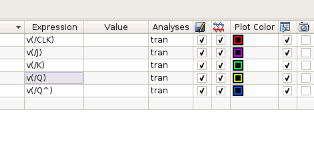

# JK-flipflop-CMOS-using-Synopsys

#### This repository is about JK Flip-Flop 28nm CMOS using Synopsys Custom Compiler tool.

## Table of Contents

* [Abstract](#Abstract)
* [Synopsys Custom Compiler Tool](#Synopsys-Custom-Compiler-Tool)
* [Reference Circuit Diagram](#Reference-Circuit-Diagram)
* [Reference Circuit Waveform](#Reference-Circuit-Waveform)
* [Synopsys Simulation](#Synopsys-Simulation)
    * [Schematic](#Schematic)
    * [Symbol](#Symbol)
    * [Test Bench](#Test-Bench)
        * [Circuit](#Circuit)
        * [Signal Parameters](#Signal-Parameters)
        * [Transient Settings](#Transient-Settings)
    * [Netlist](#Netlist)
    * [Waveform](#Waveform)
    * [Logs](#Logs)
* [Conclusion](#Conclusion)
* [Author](#Author)
* [Acknowledgement](#Acknowledgement)
* [References](#References)

## Abstract

Digital circuits are composed of logic functions which are then implemented using building blocks. AND, OR and NOT are basic building blocks of every digital logic. Many different modules are created using combination of these gates to achieve various functionality. One of such modules is JK flip-flop. This flip-flop is one of the most used flip-flop over every digital electronics. The inputs to this flip flop are ‘J’ and ‘K’. The JK flip flop work in the same way as the SR flip flop. The only difference between JK flip flop is that when both inputs of SR flip flop is set to 1, the circuit produces the invalid states as outputs, but in case of JK flip 
flop, there are no invalid states even if both ‘J’ and ‘K’ flip flop are set to 1. The JK flip flop is a gated SR flip flop having the addition of a clock input circuitry. The invalid or illegal output condition occurs when both of the inputs are set to 1 and are prevented by the addition of a clock input circuit. The JK flip flop is an improved clocked SR flip flop, but it still suffers from “race around” condition. We have to keep short timing pulse for avoiding this condition.

## Synopsys Custom Compiler Tool

<p align="center">
</br>
  Figure 1 : Synopsis Custom Compiler Tool
</p>

## Reference Circuit Diagram

<p align="center">
  </br>
  Figure 2 : Reference Circuit Diagram
</p>

## Reference Circuit Waveform

<p align="center">
</br>
  Figure 3 : Reference Circuit Waveform
</p>

## Synopsys Simulation

### Schematic

<p align="center">
</br>
  Figure 4 : Schematic
</p>

### Symbol

<p align="center">
</br>
  Figure 5 : Device Symbol
</p>

### Test Bench

#### Circuit

<p align="center">
</br>
  Figure 6 : Testbench Circuit
</p>

#### Signal Parameters

<p align="center">
</br>
  Figure 7 : Input parameter of CLK shown, similar config for other inputs but different periods
</p>

#### Transient Settings

<p align="center">
</br>
  Figure 8 : Add Model Files
</p>
<p align="center">
</br>
  Figure 9 : Create Analyses
</p>
<p align="center">
</br>
  Figure 10 : Waveform Setup
</p>

### Netlist

```
*  Generated for: PrimeSim
*  Design library name: ah_JKFF
*  Design cell name: JKFF_test
*  Design view name: schematic
.lib 'saed32nm.lib' TT

*Custom Compiler Version S-2021.09
*Sat Feb 26 15:32:06 2022

.global gnd! vdd!
********************************************************************************
* Library          : ah_JKFF
* Cell             : JKFF_try
* View             : schematic
* View Search List : hspice hspiceD schematic spice veriloga
* View Stop List   : hspice hspiceD
********************************************************************************
.subckt jkff_try clk gnd_1 j k q q^ vdd vt_bulk_n_gnd! vt_bulk_p_vdd!
xm7 net22 q^ gnd_1 vt_bulk_n_gnd! n105 w=0.1u l=0.03u nf=1 m=1
xm6 net19 clk net22 vt_bulk_n_gnd! n105 w=0.1u l=0.03u nf=1 m=1
xm5 q^ j net19 vt_bulk_n_gnd! n105 w=0.1u l=0.03u nf=1 m=1
xm4 q^ q gnd_1 vt_bulk_n_gnd! n105 w=0.1u l=0.03u nf=1 m=1
xm3 q q^ gnd_1 vt_bulk_n_gnd! n105 w=0.1u l=0.03u nf=1 m=1
xm2 net7 q gnd_1 vt_bulk_n_gnd! n105 w=0.1u l=0.03u nf=1 m=1
xm1 net4 clk net7 vt_bulk_n_gnd! n105 w=0.1u l=0.03u nf=1 m=1
xm0 q k net4 vt_bulk_n_gnd! n105 w=0.1u l=0.03u nf=1 m=1
xm15 net40 j vdd vt_bulk_p_vdd! p105 w=0.1u l=0.03u nf=1 m=1
xm14 net40 q^ vdd vt_bulk_p_vdd! p105 w=0.1u l=0.03u nf=1 m=1
xm13 q^ q net40 vt_bulk_p_vdd! p105 w=0.1u l=0.03u nf=1 m=1
xm12 net40 clk vdd vt_bulk_p_vdd! p105 w=0.1u l=0.03u nf=1 m=1
xm11 net35 clk vdd vt_bulk_p_vdd! p105 w=0.1u l=0.03u nf=1 m=1
xm10 net35 q vdd vt_bulk_p_vdd! p105 w=0.1u l=0.03u nf=1 m=1
xm9 net35 k vdd vt_bulk_p_vdd! p105 w=0.1u l=0.03u nf=1 m=1
xm8 q q^ net35 vt_bulk_p_vdd! p105 w=0.1u l=0.03u nf=1 m=1
.ends jkff_try

********************************************************************************
* Library          : ah_JKFF
* Cell             : JKFF_test
* View             : schematic
* View Search List : hspice hspiceD schematic spice veriloga
* View Stop List   : hspice hspiceD
********************************************************************************
xi0 clk gnd! j k q q^ net9 gnd! vdd! jkff_try
v1 net9 gnd! dc=1.8
c9 q gnd! c=5p
c8 q^ gnd! c=5p
v20 k gnd! dc=0 pulse ( 1.05 1.05 30u 0.1u 0.1u 10u 20u )
v21 j gnd! dc=0 pulse ( 0 0 30u 0.1u 0.1u 20u 40u )
v10 clk gnd! dc=0 pulse ( 0 1.05 0 0.1u 0.1u 5u 10u )


.tran '1u' '100u' name=tran

.option primesim_remove_probe_prefix = 0
.probe v(*) i(*) level=1
.probe tran v(clk) v(j) v(k) v(q) v(q^)

.temp 25


.option primesim_output=wdf


.option parhier = LOCAL


.end

```

### Waveform

<p align="center">
</br>
  Figure 11 : Waveform
</p>

### Logs

```

                                   PrimeSim 

                 Version S-2021.09 for linux64 - Aug 26, 2021 

                    Copyright (c) 2003 - 2021 Synopsys, Inc.
   This software and the associated documentation are proprietary to Synopsys,
 Inc. This software may only be used in accordance with the terms and conditions
 of a written license agreement with Synopsys, Inc. All other use, reproduction,
   or distribution of this software is strictly prohibited.  Licensed Products
     communicate with Synopsys servers for the purpose of providing software
    updates, detecting software piracy and verifying that customers are using
    Licensed Products in conformity with the applicable License Key for such
  Licensed Products. Synopsys will use information gathered in connection with
    this process to deliver software updates and pursue software pirates and
                                   infringers.

 Inclusivity & Diversity - Visit SolvNetPlus to read the "Synopsys Statement on
            Inclusivity and Diversity" (Refer to article 000036315 at
                        https://solvnetplus.synopsys.com)
---------------------------------------------------------------------------------

PrimeSim SPICE S-2021.09 RHEL64  (Compiled on Aug 26 2021 at 14:29:28 (US-Pacific)) build id: 7232578

Hostname: snps-analog-group-06, Username: souhardhyapaul1999
Tool Path: /Applications/Synopsys/Install/primesim/S-2021.09/primesim/platform/linux64/primesim_spice

PrimeSim SPICE S-2021.09 RHEL64  (Compiled on Aug 26 2021 at 14:29:28 (US-Pacific)) build id: 7232578

Hostname: snps-analog-group-06, Username: souhardhyapaul1999, PID: 3866
Tool Path: /Applications/Synopsys/Install/primesim/S-2021.09/primesim/platform/linux64/primesim_spice

**** Environment Variables
(NAME)               (VALUE) 
LD_LIBRARY_PATH      /Applications/Synopsys/Install/primesim/S-2021.09/lib/linux64:/Applications/Synopsys/Install/primesim/S-2021.09/python/linux64/lib:/Applications/Synopsys/Install/customcompiler/S-2021.09/linux64/platform/lib/python-2.6:/Applications/Synopsys/Install/customcompiler/S-2021.09/linux
64/lib/freeType:/Applications/Synopsys/Install/customcompiler/S-2021.09/linux64/platform/lib:/Applications/Synopsys/Install/customcompiler/S-2021.09/linux64/lib:/Applications/Synopsys/Install/customcompiler/S-2021.09/linux64/OA/lib/linux_rhel60_64/opt:/Applications/Synopsys/Install/customcompiler/S-2
021.09/linux64/PyCellStudio/linux64/3rd/Python/lib:/Applications/Synopsys/Install/customcompiler/S-2021.09/linux64/PySide/2.6.2/lib:/Applications/Synopsys/Install/customcompiler/S-2021.09/linux64/PyCellStudio/linux64/lib:/Applications/Synopsys/Install/customcompiler/S-2021.09/linux64/PyCellStudio/lin
ux64/lib/python-38:/Applications/Synopsys/Install/customcompiler/S-2021.09/linux64/PyCellStudio/linux64/lib/python-26 
PRIMESIM             1 
PRIMESIM_HOME        /Applications/Synopsys/Install/primesim/S-2021.09 
****


FlexNet Licensing checkout error: No such feature exists.
Feature:       SYNOPSYS_ANOMALY
License path:  27020@178.128.123.110:
FlexNet Licensing error:-5,147.  System Error: 2 "No such file or directory"
license file(s):  27020@178.128.123.110
[SCL] 02/26/2022 15:32:07 PID:3866 Client:snps-analog-group-06 Server:27020@178.128.123.110 Authorization succeeded primesim 2021.09
Started at Sat Feb 26 15:32:07 2022
Command line:   /Applications/Synopsys/Install/primesim/S-2021.09/bin/primesim /home/souhardhyapaul1999/simulation/TestSuite17/history_1/simulation/Testbench1/PrimeSimSPICE/nominal/netlist/primesim.spi -o primesim -remove_backslash -spice -sae -inc /PDK/SAED_PDK32nm/hspice
Working Directory: /home/souhardhyapaul1999/simulation/TestSuite17/history_1/simulation/Testbench1/PrimeSimSPICE/nominal/results

INFO! read global configuration file (/Applications/Synopsys/Install/primesim/S-2021.09/primesim.cfg)

                </PDK/SAED_PDK32nm/hspice/saed32nm.lib>

Resource Usage for Reading Netlist(self/total): 0.1/0.1 sec (cpu), 0.0/0.0 sec (elapsed), 767.4/767.4 MB

primesim_output_dc=wdf is used for .dc analysis.
primesim_output_op=wdf is used for .op analysis
primesim_output_ac=wdf is used for .ac analysis

**** Used Options:
   primesim_remove_probe_prefix = 0
   primesim_output = wdf
   parhier = local
****

**** Macro Options:
****
  Main Setting: runlvl
Resource Usage for Parsing(self/total): 0.0/0.1 sec (cpu), 0.0/0.0 sec (elapsed), 14.5/781.9 MB

Simulation mode: SPICE
Checkout succeeded: primesim/3FF452EEFC581681C6D8
  License file: 27020@178.128.123.110
  License Server: 27020@178.128.123.110
Checkout succeeded: primesim/3FF452EEFC581681C6D8
  License file: 27020@178.128.123.110
  License Server: 27020@178.128.123.110
[SCL] Checking status for feature primesim - 02/26/2022 15:32:07
[SCL] 02/26/2022 15:32:07 PID:3866 Client:snps-analog-group-06 Server:27020@178.128.123.110 Checkout succeeded primesim 2021.09
License: Checked out primesim(2) successfully from :27020@178.128.123.110 

Resource Usage for License(self/total): 0.0/0.1 sec (cpu), 0.0/0.0 sec (elapsed), 2.3/784.2 MB

Elapsed checking license time: 0.0 seconds

Title: *  Generated for: PrimeSim


**** expand probe
   probe pattern 'v(*)' (level=1) matches with 9 nodes on toplevel (primesim.spi:62)
   probe pattern 'i(*)' (level=1) matches with 4 devices on toplevel (primesim.spi:62)
****

WARNING! reuse_op: for source:v20: its dc value is different with its time 0 value.
WARNING! "risetime" set to 2.500000e-07 accoording to user-specified "tstep" value (25%).

  # MOSFET   : 16
  # Capacitor: 2 (Min/Max=5e-12/5e-12) 
  # V Source : 4 (Max/Min=1.8V/0V)

  TEMP=25
Resource Usage for Circuit Elaboration(self/total): 0.0/0.2 sec (cpu), 0.0/0.0 sec (elapsed), 44.8/829.0 MB

Generating MOS models ...
  Table value up to 1.8V
  Model 4/5
  Level=54 Version=4.5
Resource Usage for MOS Model(self/total): 0.0/0.2 sec (cpu), 0.0/0.0 sec (elapsed), 2.9/831.9 MB


Building Connectivity ...
Resource Usage for Connectivity Building(self/total): 0.0/0.2 sec (cpu), 0.0/0.0 sec (elapsed), -9.0/822.9 MB

Building DB ...
Resource Usage for DB Building(self/total): 0.0/0.2 sec (cpu), 0.0/0.0 sec (elapsed), 0.0/822.9 MB

Initializing ...
Resource Usage for Initialization(self/total): 0.0/0.2 sec (cpu), 0.0/0.0 sec (elapsed), 0.0/822.9 MB

Preparing Outputs ...
  # probed signals  : 13
Resource Usage for Output Preparation(self/total): 0.0/0.2 sec (cpu), 0.0/0.0 sec (elapsed), 0.0/822.9 MB


Building Matrices ...
Resource Usage for Matrix Building(self/total): 0.0/0.2 sec (cpu), 0.0/0.0 sec (elapsed), -12.0/810.9 MB

Starting DC Initialization ...
    ic file 'primesim.ic'
  DC converged at step 1

End of DC Initialization
Resource Usage for DC Initialization(self/total): 0.0/0.2 sec (cpu), 0.0/0.0 sec (elapsed), 3.0/813.9 MB

Starting Transient Analysis ...
  Important settings:
  runlvl = 4
  tolscale = 10
    finished at 100us
    output file 'primesim_wdf/tran.tran'
    # time points: 497
End of Transient Analysis                               
Resource Usage for Transient Analysis(self/total): 0.0/0.3 sec (cpu), 0.0/0.0 sec (elapsed), 8.6/822.5 MB

Simulation ended at Sat Feb 26 15:32:07 2022

Total CPU time: 0.3 seconds (0.00 hours)
Total memory usage: peak= 831.9 MB, avg= 611.0 MB

Total elapsed time: 0.0 seconds (0.00 hours)
PrimeSim Successfully Completed at Sat Feb 26 15:32:07 2022

[SCL] 02/26/2022 15:32:07 PID:3866 Client:snps-analog-group-06 checkin primesim 

```

## Conclusion

As per the initial design the circuit is implemented successfully. Futher improvement is possible in the design. This version suffers race around condition moreover PMOS and NMOS are not exactly identical, leading to some unwanted outputs, which can be improved further.


## Author

Souhardhya Paul, B.Tech, Electronics and Communication Engineering, Netaji Subhash Engineering College, Kolkata.

## Acknowledgement

1. [Cloud Based Analog IC Design Hackathon](https://www.iith.ac.in/events/2022/02/15/Cloud-Based-Analog-IC-Design-Hackathon/)
2. [Synopsys India](https://www.synopsys.com/)
3. [VLSI System Design (VSD) Corp. Pvt. Ltd India](https://www.vlsisystemdesign.com/)
4. Kunal Ghosh, Co-founder, VSD Corp. Pvt. Ltd. - kunalpghosh@gmail.com
5. Chinmay Panda, IIT Hyderabad
6. Sameer Durgoji, NIT Karnataka

## References

[1] F. Stas and D. Bol, "A 0.4-V 0.66-fJ/Cycle Retentive True-Single-Phase-Clock 18T Flip-Flop in 28-nm Fully-Depleted SOI CMOS," in IEEE Transactions on Circuits and Systems I: Regular Papers, vol. 65, no. 3, pp. 935-945, March 2018, doi: 10.1109/TCSI.2017.2763423.

[2] Design of Flip-Flops for High Performance VLSI Applications using Deep Submicron CMOS Technology, Rishikesh V. Tambat and Sonal A.Lakhotiya. Article published in International Journal of Current Engineering and Technology, Vol.4,No.2 (April- 2014).
